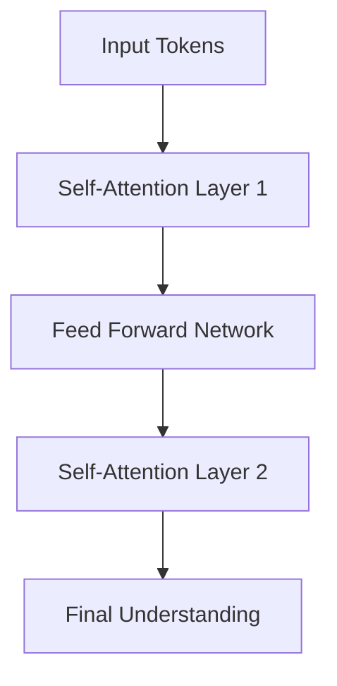

# Understanding the AI Components in Quiz Generator

## Pre-trained Model and Pipeline Explanation

### The Core AI Setup
```python
self.generator = pipeline('text2text-generation', model='facebook/bart-large-cnn')
```

### Understanding Pipeline
A pipeline in Hugging Face's transformers library is like a smart factory that automates the complex process of using AI models. Instead of setting up each component manually (tokenizer, model, post-processing), the pipeline handles everything in one go.

### Text-to-Text Generation
The `'text2text-generation'` parameter tells our pipeline what type of task to perform. As the name suggests, it:
- Takes text as input
- Processes it through the model
- Generates new text as output

In our quiz generator, we input a prompt requesting a question, and it outputs a formatted quiz question.

### BART Model (facebook/bart-large-cnn)
BART (Bidirectional and Auto-Regressive Transformers) is a powerful language model developed by Facebook (Meta). The 'large-cnn' version has specific characteristics:
- Trained on news articles
- Good at understanding and generating structured text
- Capable of following complex instructions
- Effective at maintaining context and coherence

### Accessing Generated Content
```python
output[0]['generated_text']
```
This line accesses the model's output:
- `output[0]`: Gets the first generated result (models can generate multiple versions)
- `['generated_text']`: Accesses the actual text content from the result dictionary

## How It All Works Together

### The Generation Process
When you request a quiz question, here's what happens:

1. **Input Processing**
   - Your topic and difficulty level are formatted into a prompt
   - The prompt is sent to the model through the pipeline

2. **Model Processing**
   - BART reads and understands the entire prompt
   - Uses its "attention" mechanisms to process the request
   - Accesses its trained knowledge about the topic

3. **Output Generation**
   - Creates a relevant question based on understanding
   - Structures it appropriately for a quiz format
   - Returns the generated text

### Example Flow
```python
# User inputs "cybersecurity" as topic
prompt = "Generate a medium difficulty question about cybersecurity"

# Model processes this using its knowledge and training
output = self.generator(prompt)

# Access the generated question
question = output[0]['generated_text']
```

### Advantages of This Approach
1. **Flexibility**: Can handle any computing-related topic
2. **Intelligence**: Generates contextually appropriate questions
3. **Coherence**: Creates well-structured, meaningful content
4. **Efficiency**: Handles complex NLP tasks internally

### Behind the Scenes
BART uses transformer architecture, which means:
- It processes entire text sequences at once
- Understands relationships between different parts of text
- Utilizes massive pre-training on diverse texts
- Can generate novel, contextually appropriate content

## Why This Model?

### Key Benefits
1. Powerful enough for complex topics
2. Pre-trained on extensive data
3. Generates coherent, structured text
4. Follows instructions well
5. Efficient processing

### Practical Application
When generating quiz questions, the model:
- Accesses relevant domain knowledge
- Understands question-writing principles
- Creates appropriate difficulty levels
- Structures output for multiple choice format

# Understanding How BART Processes Text in Quiz Generator

## Text Processing Flow

### 1. Input Phase: From Text to Tokens
When you input a prompt like "Generate a question about Python functions", the model:
```python
# Example internal process (not actual code)
input_text = "Generate a question about Python functions"
```

The model first breaks this into tokens:
```python
tokens = [
    "Generate",
    "a",
    "question",
    "about",
    "Python",
    "functions"
]
```

Each token is then converted to a numerical representation:
```python
# Internal representation
token_ids = [
    1456,  # "Generate"
    7,     # "a"
    892,   # "question"
    102,   # "about"
    2456,  # "Python"
    3789   # "functions"
]
```

### 2. Processing Phase: Understanding Context

The model uses multiple layers of attention to understand relationships:



Each token pays "attention" to other tokens:
```
"Python" → strongly connected to → "functions"
"question" → connected to → "Generate"
```

### 3. Generation Phase: Creating the Question

The model then generates text token by token:
```python
# Example generation process
generated_tokens = []

while not is_complete:
    next_token = predict_next_token(generated_tokens)
    generated_tokens.append(next_token)
```

## Deeper Understanding of the Process

### Self-Attention Mechanism
Think of it like this: When you read "Python functions", you automatically connect:
- Python → programming language
- functions → code blocks
- Python functions → reusable code pieces

The model does this through attention scores:
```
Word       | Python | functions | question
-------------------------
Python     |   1.0  |    0.8   |   0.3
functions  |   0.8  |    1.0   |   0.4
question   |   0.3  |    0.4   |   1.0
```

### Contextual Understanding
The model understands that:
1. "Python functions" in programming context means:
   - Callable code blocks
   - def keyword
   - Parameters and returns

2. When generating a question, it knows to:
   - Use appropriate technical terms
   - Match the difficulty level
   - Create relevant multiple-choice options

### Example Processing Flow
```python
# Input prompt
"Generate a medium difficulty question about Python functions"

# Model's internal process:
1. Understands context: Programming, Python-specific
2. Identifies key concepts: Functions, parameters, returns
3. Determines appropriate difficulty
4. Generates structured question
5. Creates relevant answer options
```

## Practical Example

### Input to Output Flow:
```
INPUT: "Generate a question about Python functions"

INTERNAL PROCESSING:
1. Topic Recognition: Python programming, functions
2. Concept Mapping:
   - Function definition
   - Parameters
   - Return values
   - Usage scenarios

OUTPUT: "What is the correct way to define a function in Python?
A) def function_name():
B) function function_name():
C) define function_name():
D) func function_name():"
```

### Why This Works Well

The model excels because it:
1. **Maintains Context**
   - Understands programming terminology
   - Keeps track of the topic throughout generation

2. **Structured Output**
   - Generates coherent questions
   - Creates relevant multiple-choice options
   - Maintains appropriate difficulty level

3. **Knowledge Integration**
   - Combines understanding of:
     - Programming concepts
     - Question formation
     - Educational assessment principles
